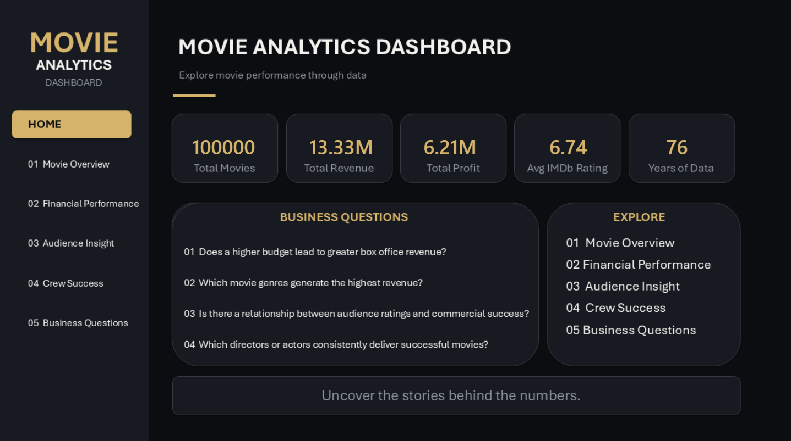
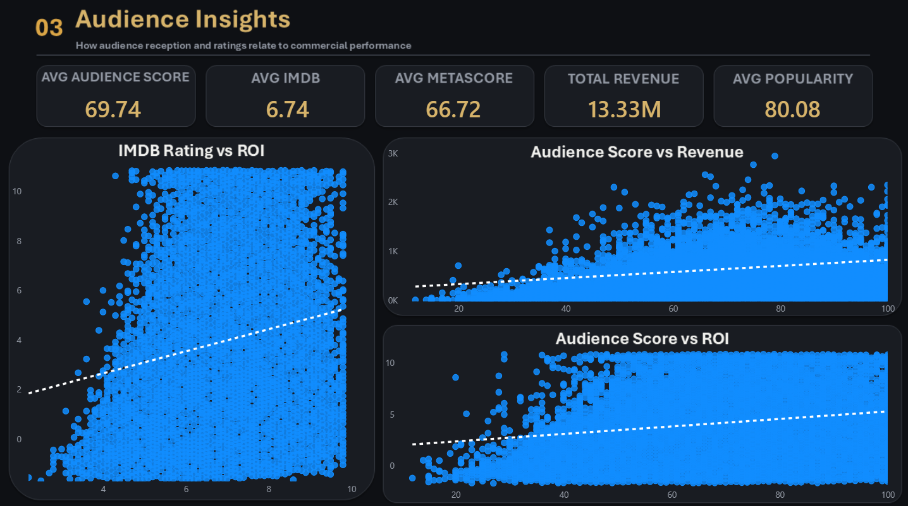
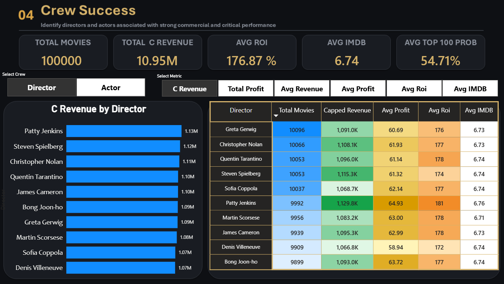
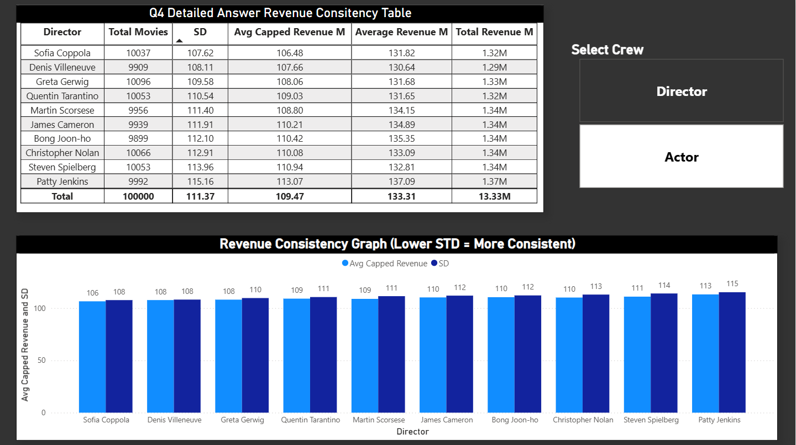

# Power BI Dashboard

This folder contains the Power BI dashboard developed for the **Global Movie Success Analysis** project.

The dashboard uses the cleaned, analysis-ready dataset prepared through Python and provides interactive analysis across the four business questions.

---

## Dashboard Files

| File | Description |
|---|---|
| [Power BI Dashboard](Global%20Movie%20Dataset%20Analysis.pbix) | Power BI project containing the interactive dashboard |
| [Dashboard PDF](Global%20Movie%20Dataset%20Analysis.pdf) | PDF export of the Power BI dashboard |
| [Page screenshots](03_Global-Movie-Success-Analysis/Screenshots) | Individual screenshots of the Power BI dashboard pages |

> **Note:** The PBIX file is the main interactive version of the dashboard. The PDF and screenshots are provided for quick viewing without opening Power BI.

---

## Dashboard Preview

The dashboard is organized to present the analysis progressively, from overall movie performance to the individual business questions.

### Dashboard Page 1



### Dashboard Page 2


### Dashboard Page 3


### Dashboard Page 4



### Dashboard Page 5



### Dashboard Page 6


### Dashboard Page 7



---

# Project Workflow

The Power BI dashboard was the final analytical stage of the project.

```text
Kaggle Raw Dataset
        ↓
Python Data Cleaning & EDA
        ↓
Outlier / Revenue Analysis
        ↓
Cleaned Analysis-Ready Dataset
        ↓
Power BI Data Modeling
        ↓
DAX Calculations
        ↓
Interactive Dashboard
        ↓
Business Insights & Recommendations
