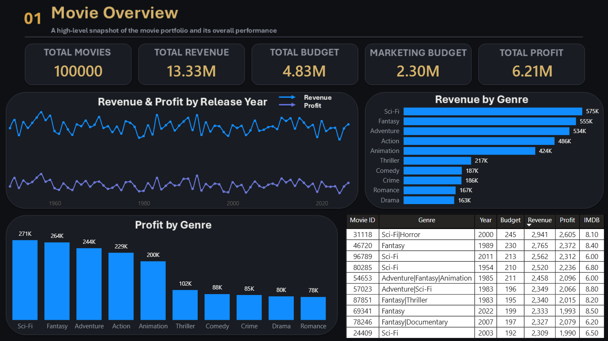
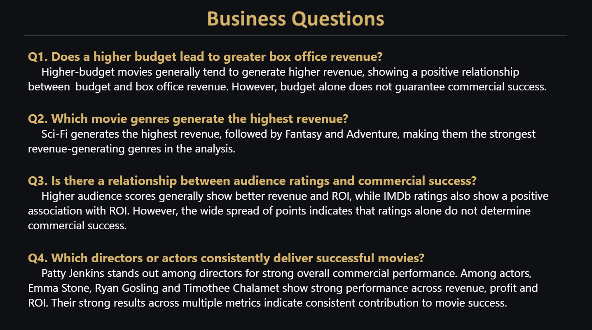

# Screenshots

This folder contains visual references from the **Global Movie Success Analysis** project.

It includes screenshots of the Power BI dashboard pages and close-up supporting visuals used to explain the four business questions.

---

# Power BI Dashboard Screenshots

The following screenshots provide a visual overview of the interactive Power BI dashboard.

## Dashboard Overview

[Power BI Dashboard](03_Global-Movie-Success-Analysis/Power-BI/Global Movie Dataset Analysis.pbix)

---

## Dashboard Pages

### Dashboard Page 1


### Dashboard Page 2



### Dashboard Page 3


### Dashboard Page 4


### Dashboard Page 5


### Dashboard Page 6



### Dashboard Page 7


---
# Business Question Supporting Visuals

These are close-up visuals extracted from the analysis to support the answers to the four main business questions.

---

## Q1 — Budget vs Revenue

### Question

**Does a higher budget lead to greater box office revenue?**


The scatter plot compares movie budget with box office revenue. Higher-budget movies generally tend to generate higher revenue, but budget alone does not guarantee commercial success.

---

## Q2 — Genre Performance

### Question

**Which movie genres generate the highest revenue?**

### Revenue by Genre


### Profit by Genre


The visuals compare the top genres based on revenue and profit. Sci-Fi, Fantasy and Adventure are among the leading genres across both measures.

---

## Q3 — Audience Ratings & Commercial Success

### Question

**Is there a relationship between audience ratings and commercial success?**

### IMDb Rating vs ROI


### Audience Score vs Revenue


### Audience Score vs ROI


The visuals suggest that better audience reception is generally associated with stronger commercial performance. However, the spread of the data indicates that ratings alone cannot determine a movie's commercial success.

---

## Q4 — Crew Performance

### Question

**Which directors or actors consistently deliver successful movies?**

### Director Performance


### Actor Performance


The crew analysis considers commercial performance together with revenue variation. Revenue capping was used to reduce the influence of extreme revenue observations.

Standard deviation was used to understand revenue variation:

**Lower Standard Deviation → Lower Revenue Variation → More Consistent Performance**

The analysis shows strong commercial performance for selected directors and actors, while also highlighting that high average revenue does not automatically mean consistent performance.

---

# Business Question Visual Summary

| Question | Supporting Visuals |
|---|---|
| Q1 — Budget vs Revenue | [Budget vs Revenue](Q1%20Budget%20vs%20Revenue.png) |
| Q2 — Genre Performance | [Revenue by Genre](Q2%20Rev%20vs%20Genre.png) · [Profit by Genre](Q2.1%20Profit%20vs%20Genre.png) |
| Q3 — Audience & Commercial Success | [IMDb Rating vs ROI](Q3%20imdb%20rating%20vs%20ROI.png) · [Audience Score vs Revenue](Q3.1%20Audience%20Score%20vs%20Revenue.png) · [Audience Score vs ROI](Q3.2%20Audience%20Score%20vs%20ROI.png) |
| Q4 — Crew Performance | [Director Performance](Q4%20Director%20Performance.png) · [Actor Performance](Q4.1%20ActorPerformance.png.png) |

---

# Visualization Workflow

The screenshots represent the final visual outputs of the project.

```text
Raw Kaggle Dataset
        ↓
Python Cleaning & EDA
        ↓
Cleaned Analysis-Ready Dataset
        ↓
Power BI Dashboard
        ↓
Business Question Analysis
        ↓
Supporting Visuals
