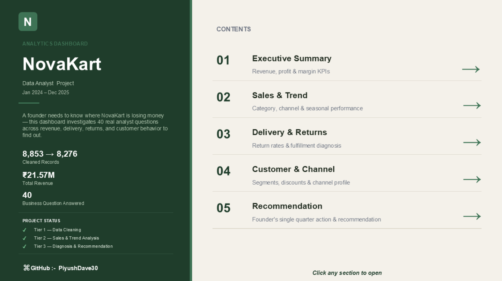
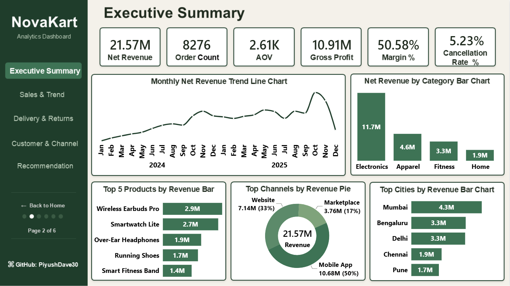
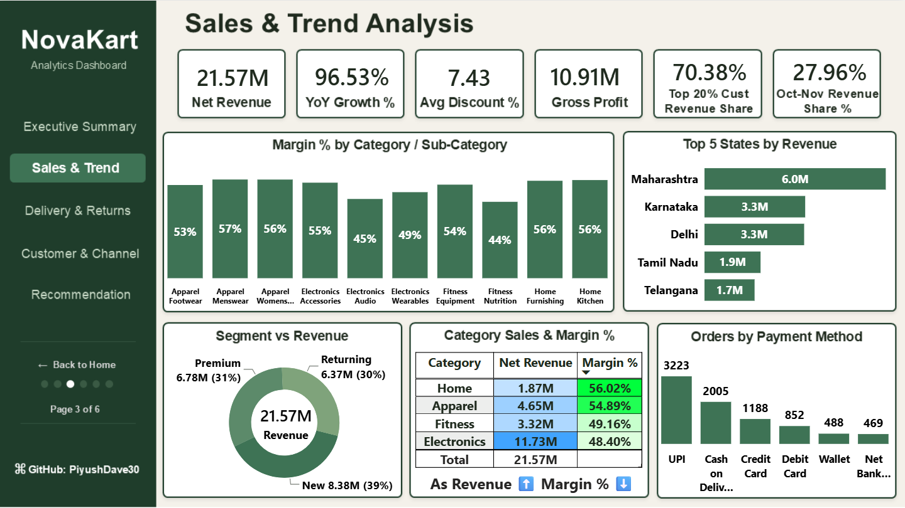
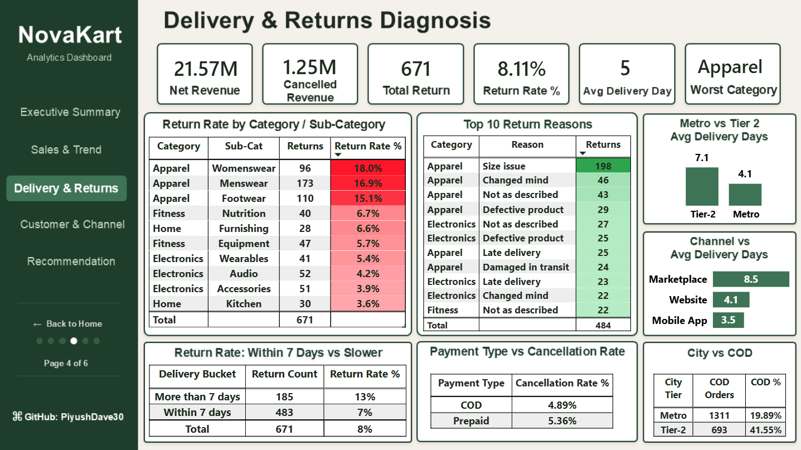
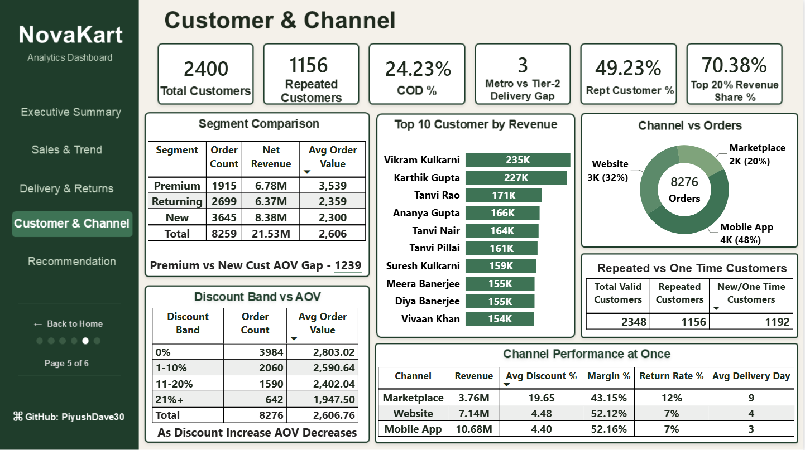
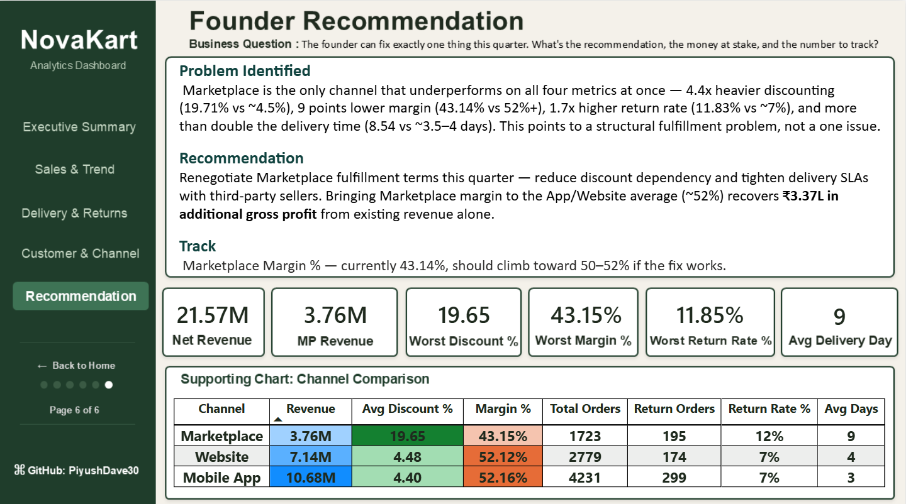

# NovaKart Analytics Dashboard

**A founder needs to know where NovaKart is losing money.** This project investigates 39 real business questions across revenue, sales trends, delivery, returns, and customer behavior — built entirely in Power BI with Power Query and DAX — and closes with a single, quantified recommendation for the founder's next quarter.



---

## 📁 Repository Structure

```
NovaKart-Analytics-Dashboard/
├── Raw-Data/
│   └── NovaKart_Analyst_Practice_Pack.xlsx     # Source dataset + cleaned tables
├── PowerBI-File/
│   ├── NovaKart_Analysis.pbix                  # Full interactive Power BI file
│   └── NovaKart_Analysis.pdf                   # Static export (no Power BI needed)
├── Screenshots/
│   ├── Home.png
│   ├── Executive_Summary.png
│   ├── Sales_Analysis.png
│   ├── Delivery_Return_Insight.png
│   ├── Customer_Analysis.png
│   └── Recommendation.png
└── README.md
```

## 🛠 Tools Used
- **Power BI Desktop** — data modelling, DAX measures, dashboard design
- **Power Query** — data cleaning and transformation
- **DAX** — 30+ custom measures across revenue, margin, delivery, returns, and customer behavior

## 📦 Dataset
NovaKart Analyst Practice Pack — four related tables: `orders`, `customers`, `products`, `returns`. Deliberately dirty data (duplicates, inconsistent formats, orphan IDs) used to simulate a real-world analyst workflow.

---

## Tier 1 — Data Cleaning

| Step | Finding |
|---|---|
| Raw record counts | orders 8,853 · customers 2,400 · products 25 · returns 671 |
| Duplicate rows | Removed exact duplicate order rows |
| Date format | Mixed `YYYY-MM-DD` and `DD-MM-YYYY` formats standardized |
| Blank values | `payment_method` and `delivery_days` blanks left as-is (not imputed, to avoid distorting delivery-time analysis) |
| Invalid quantities | Rows with quantity ≤ 0 removed |
| Discount scale | Mixed fraction/whole-number discount values rescaled to a consistent percentage |
| City inconsistency | City names standardized (casing + whitespace) |
| Orphan customer IDs | Orders with no matching customer kept via **Left Join** (not dropped) to preserve real revenue |

**Result: 8,853 raw records → 8,276 clean, analysis-ready orders.**

---

## 📊 Page 1 — Executive Summary



| Metric | Value |
|---|---|
| Net Revenue | ₹21.57M |
| Order Count | 8,276 |
| AOV | ₹2.61K |
| Gross Profit | ₹10.91M |
| Margin % | 50.58% |
| Cancellation Rate % | 5.23% |

**Key findings:**
- **Top category by revenue:** Electronics (₹11.7M), far ahead of Apparel (₹4.6M), Fitness (₹3.3M), and Home (₹1.9M)
- **Top 5 products:** Wireless Earbuds Pro (₹2.9M), Smartwatch Lite (₹2.7M), Over-Ear Headphones (₹1.9M), Running Shoes (₹1.7M), Smart Fitness Band (₹1.4M)
- **Channel split:** Mobile App drives 50% of revenue (₹10.68M), Website 33% (₹7.14M), Marketplace 17% (₹3.76M)
- **Top 5 cities:** Mumbai (₹4.3M), Bengaluru (₹3.3M), Delhi (₹3.3M), Chennai (₹1.9M), Pune (₹1.7M)
- Monthly revenue trend shows steady growth from Jan 2024, with a clear seasonal spike around Oct–Nov each year

---

## 📈 Page 2 — Sales & Trend Analysis



| Metric | Value |
|---|---|
| Net Revenue | ₹21.57M |
| YoY Growth % | 96.53% |
| Avg Discount % | 7.43% |
| Gross Profit | ₹10.91M |
| Top 20% Customer Revenue Share | 70.38% |
| Oct–Nov Revenue Share % | 27.96% |

**Key findings:**
- Revenue nearly **doubled year-over-year** (96.53% growth, 2024 → 2025)
- **October–November alone contribute 27.96%** of annual revenue — well above the ~16.7% expected from an even 12-month spread, consistent with India's festive shopping season
- **Category margin vs revenue is inverted:** Electronics generates the most revenue (₹11.73M) but has the *lowest* margin (48.40%), while Home generates the least revenue (₹1.87M) but has the *highest* margin (56.02%) — chasing revenue growth by category size alone would be misleading
- **Top 5 states:** Maharashtra (₹6.0M), Karnataka (₹3.3M), Delhi (₹3.3M), Tamil Nadu (₹1.9M), Telangana (₹1.7M)
- **Top payment method:** UPI (3,223 orders), followed by Cash on Delivery (2,005)
- Customer segment revenue split: New 39% (₹8.38M), Premium 31% (₹6.78M), Returning 30% (₹6.37M)

---

## 🚚 Page 3 — Delivery & Returns Diagnosis



| Metric | Value |
|---|---|
| Net Revenue | ₹21.57M |
| Cancelled Revenue | ₹1.25M |
| Total Returns | 671 |
| Return Rate % | 8.11% |
| Avg Delivery Days | 5 |
| Worst Category | Apparel |

**Key findings:**
- **Apparel is the clear outlier on returns:** Womenswear (18.0%), Menswear (16.9%), and Footwear (15.1%) are the three highest sub-category return rates in the entire dataset — every other sub-category sits under 7%
- **Top return reason:** Size issue (198 cases) — reinforces that Apparel's problem is fit-related, not product quality
- **Delivery speed correlates with returns:** orders delivered in more than 7 days return at 13%, vs 7% for orders delivered within 7 days
- **Tier-2 cities wait longer:** 7.1 days average vs 4.1 days in Metro cities — a 3-day gap
- **Marketplace is the slowest channel:** 8.5 days average delivery, more than double Mobile App's 3.5 days
- **COD is not riskier than Prepaid:** Cancellation rate is actually slightly *lower* for COD (4.89%) than Prepaid (5.36%)
- **Tier-2 customers rely on COD more than twice as often** as Metro customers (41.55% vs 19.89%)

---

## 👥 Page 4 — Customer & Channel Deep-Dive



| Metric | Value |
|---|---|
| Total Customers | 2,400 |
| Repeated Customers | 1,156 |
| COD % | 24.23% |
| Metro vs Tier-2 Delivery Gap | 3 days |
| Repeat Customer % | 49.23% |
| Top 20% Revenue Share % | 70.38% |

**Key findings:**
- **Nearly half of all customers are repeat buyers** (49.23%), and the **top 20% of customers drive 70.38%** of total revenue — a small customer base is disproportionately valuable
- **Premium customers spend 54% more per order than New customers** — a ₹1,239 AOV gap (₹3,539 vs ₹2,300) — despite placing far fewer orders. New customers drive volume; Premium customers drive value.
- **Heavier discounts correlate with smaller orders, not bigger ones:** AOV falls from ₹2,803 (0% discount) to ₹1,947 (21%+ discount) — a 31% drop, the opposite of what discounting is meant to achieve
- **Marketplace underperforms on every operational metric simultaneously:**

| Channel | Revenue | Avg Discount | Margin % | Return Rate | Avg Delivery |
|---|---|---|---|---|---|
| Marketplace | ₹3.76M | 19.65% | 43.15% | 12% | 9 days |
| Website | ₹7.14M | 4.48% | 52.12% | 7% | 4 days |
| Mobile App | ₹10.68M | 4.40% | 52.16% | 7% | 3 days |

---

## 🎯 Page 5 — Founder Recommendation



> **Business Question:** *The founder can fix exactly one thing this quarter. What's the recommendation, the money at stake, and the number to track?*

### Problem Identified
Marketplace is the only channel that underperforms on all four metrics at once — 4.4x heavier discounting (19.71% vs ~4.5%), 9 points lower margin (43.14% vs 52%+), 1.7x higher return rate (11.83% vs ~7%), and more than double the delivery time (8.54 vs ~3.5–4 days). This points to a structural fulfillment problem, not an isolated issue.

### Recommendation
Renegotiate Marketplace fulfillment terms this quarter — reduce discount dependency and tighten delivery SLAs with third-party sellers. Bringing Marketplace margin to the App/Website average (~52%) recovers **₹3.37L in additional gross profit** from existing revenue alone.

### Track
**Marketplace Margin %** — currently 43.14%, should climb toward 50–52% if the fix works.

---

## 🔗 Links

- **GitHub:** [PiyushDave30](https://github.com/PiyushDave30)

---

*Data Analyst: Piyush Dave · Power BI · NovaKart Analyst Project*
